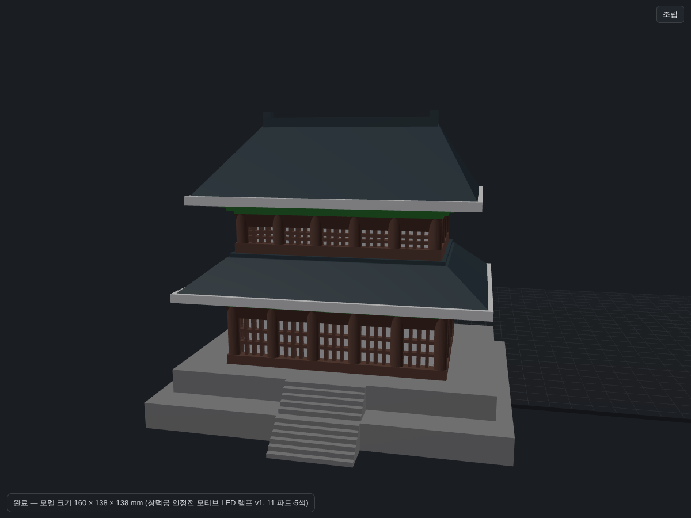
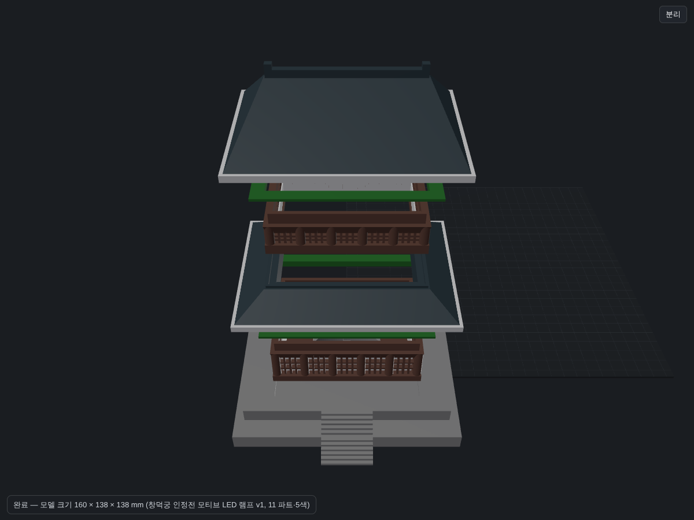

# 창덕궁 인정전(국보 225호) 모티브 LED 램프 — v2

인정전 DWG(정면·측면 치수 줄 + 정합 스캔)로 비례를 잡고, 창경궁 SketchUp 모델로 처마밑 부재(둥근 서까래 마구리·막새·선자연·추녀)를 가져왔다.
AMS 없이 색마다 따로 출력해 끼워 맞춘다(흰 마루 부품은 기와 홈에, 합각 널은 기와 포켓에). 재현: `python tools/mm.py make 작업중/changdeok-lamp/pipeline_v2.json`.

## 설계 치수표
| 이름 | 값 (mm) | 근거 |
|---|---|---|
| 축척 | 1:150 | 폭 ≈ 230 (처마 모서리) |
| 하층 정면 기둥 폭 SPAN_X | 163.0 (5칸 4.5945/4.5844/6.1244/4.5875/4.5583 m) | DWG 정면 아래 치수 줄 24,449 |
| 하층 측면 기둥 폭 SPAN_Y | 122.3 (4칸 4.58 m) | DWG 측면 아래 치수 줄 18,344.4 |
| 상층 정면 기둥 폭 USPAN_X | 142.7 (5칸 3.0582/4.5844/6.1244/4.5875/3.0484 m) | DWG 정면 위 치수 줄 |
| 상층 측면 기둥 폭 USPAN_Y | 102.7 (4칸) | DWG 측면 위 치수 줄 15,405.8 |
| 용마루 높이 | 141.2 (월대 윗면 기준) | DWG 21,181.2 |
| 하층 처마 모서리 | 225.9 × 185.4 | 정면·측면 스캔 실루엣 정합(차이 ≤ 0.9) |
| 상층 처마 모서리 | 210.2 × 170.4 | 정면·측면 스캔 실루엣 정합 |
| 안허리곡(평면 U) | 반길이의 4.4 %, ∝ t^2.7 | 평면 스캔 앞변 7점 맞춤 |
| 처마선 들림(모서리) | 3.0, 변 55 % 부터 ((t−0.55)/0.45)² | 정면 스캔 처마 끝선 |
| 용마루 휨 | 2.2·(x/56)² | 정면 스캔 |
| 취두 | 높이 용마루 위 5.2, 두께 4, 머리 밑면 경사 1.75 | 정면·측면 스캔 |
| 서까래 마구리·막새 피치 | 2.8 (마구리 Ø2.2, 막새 Ø2.0) | 창경궁 SKP(지름/피치 0.94), 실제 0.335 m 의 1.25배 과장 |
| 흰 테 | 0.7 두께, 폭 10, 위아래 틈 0.15 | 평평하게 출력해 끼우면 들림을 따라 휨(변형률 0.25 %) |
| 끼움 여유 FIT | 0.2 /한쪽 | 흰 마루 부품·합각 널 포켓 |
| 합각 널 | 두께 2.0 중 1.2 끼움 | 기와 포켓 |
| 평방 링 밑면 홈 | −1.5 ~ +2.6 (안쪽 턱 1.2) | 벽 판 1.2 + 기둥 반원 2.4 + 0.2 |
| LED | Ø59 × 18 퍽 포켓, 전선 터널 6 × 5 | Bambu LED Lamp Kit 001 |

## 출력 (플레이트 = 한 색)
| 플레이트 | 색 | 파트 | 서포트 |
|---|---|---|---|
| P01 | 회색 | 월대 | 없음(전선 터널 천장 6 mm 브리지) |
| P02 · P03 | 기와 | 하층 · 상층 기와 | 밑면 네 모서리 들림 띠(흰 테에 가려짐) |
| P04 · P05 | 갈색 | 하층 · 상층 처마밑(정방향) | 밑면 전체 + 브림 |
| P06 · P07 · P08 | 갈색 | 바닥판·벽 판 8장·평방 링 2(포개어)·합각 널 2 | 없음 |
| P09 · P10 | 초록 | 하층 · 상층 공포 띠(뒤집어) | 없음 |
| P11 | 흰색 | 하층 흰 테 + 발광 통 2(포개어) + 용마루 | 없음 |
| P12 | 흰색 | 상층 흰 테 + 내림마루 4 + 추녀마루 8(눕혀) | 없음 |

보낼 파일: **`models/injeongjeon_lamp_v2_bambu.3mf`** — Bambu 프로젝트 한 파일에 플레이트 12장(이름에 색·서포트 표시). 필라멘트 1 갈색·2 흰색·3 기와색; 회색 월대(P01)는 2번, 초록 띠(P09·P10)는 1번 자리라 미리보기 색만 다르다 — 플레이트마다 실제 색 롤을 넣고 출력. 장별 파일 `models/v2/plates/P*_bambu.3mf` 도 같이 만든다. 검사 보고: `qc/v2_pipeline/REPORT.md`.

---

## (이전) v1 기록\n\n### 창덕궁 인정전 모티브 LED 램프 — v1

**결론**: 11 파트·5색, 160 × 138 × 138 mm. 모든 파트 닫힘·조각 1, 한쪽 지지 오버행 0 mm², 브리지 최대 6.0 mm, 조립 상태 교집합 0, 끼움 여유 0.3 mm/면. 플레이트 2장 일반 3MF(lib3mf strict 경고 0). 조명은 Bambu LED Lamp Kit 001(Ø59×18 퍽)을 월대 윗면 포켓에 넣고 하층 바닥판이 덮는다. 상층 창호도 하층 지붕 가운데 87×54 개구로 빛을 받아 함께 빛난다.

| | |
|---|---|
| 조립 |  |
| 분리 |  |
| 회전 | `qc/v1/turntable.gif` (조립 → 분리 순환) |

## 1. 구성 (파트 = 색 = 필라멘트 번호)
| 번호·색 | 파트 | 출력 방향 | 크기 (출력) mm | 삼각형 | 통짜 g | 추정 g (벽 2줄·인필 15 %) |
|---|---|---|---|---|---|---|
| 1 회색 `#9e9e9e` | platform 월대 2단 + 정면 계단 2줄 + LED 포켓 + 전선 터널 | 정방향 | 160.3×138.7×23 | 592 | 433 | 121 |
| 2 갈색 `#6d4c41` | lower_body 하층 몸체(바닥판·기둥 6×5·문지방·띠살 창호·인방·테두리) | 정방향 | 103.3×70.3×36 | 9,456 | 61 | 40 |
| 2 갈색 | upper_body 상층 몸체(기둥 6×4) | 정방향 | 95.3×61.3×27 | 7,440 | 39 | 24 |
| 3 흰색 `#f5f5f5` | lower_screen / upper_screen 발광 갓(0.8 mm 단일 벽 통) | 정방향 | 90.7×57.7×19.7 / 82.7×48.7×9.7 | 64 / 64 | 6 / 2 | 6 / 2 |
| 3 흰색 | lower/upper_roof_eave_white 처마 끝 흰 띠 (지붕 오브젝트의 두 번째 파트) | 지붕과 함께 | 140.3×104.3×4 / 128.3×93.3×4 | 64 / 64 | 5 / 4 | 4 / 4 |
| 4 초록 `#2e7d32` | lower_band / upper_band 공포 띠(3단 계단, 바깥으로 7.5) | **뒤집어**(넓은 단이 바닥) | 113.3×80.3×5 / 105.3×71.3×5 | 96 / 96 | 11 / 10 | 9 / 8 |
| 5 기와색 `#37474f` | lower_roof 하층 지붕(처마판 4 + 사다리꼴 14, 가운데 개구) | 정방향(처마 아래) | 136.3×100.3×19.8 | 178 | 134 | 48 |
| 5 기와색 | upper_roof 상층 팔작지붕(합각 세로면 + 용마루·취두) | 정방향 | 124.3×89.3×42 | 166 | 250 | 67 |
| 합계 | | | | 17,900 | 957 | **≈ 334** |

높이(조립, mm): 월대 0–23 → 하층 몸체 22–58(창 27.4–45) → 공포 띠 51–56 → 하층 지붕 56–74 → 상층 몸체 74–101(창 80.4–88) → 공포 띠 94–99 → 상층 지붕 99–135, 취두 138. 지붕 경사 35.7°, 합각 밑변 50.1.
비례 출처: `refs/scan_*.jpg`(인정전 점군 실루엣: 정면 하층 처마 : 상층 처마 : 용마루 : 하층 몸체 : 월대 = 1109 : 1016 : 672 : 817 : 1372 px). 느낌 기준: 사용자가 올린 종이모형 사진(2층 팔작, 흰 처마선, 초록 공포 띠, 띠살 창, 2단 월대·계단).

## 2. 끼움·쌓임 설계 (바깥면에서 안쪽 거리 o, mm)
| 부재 | o 범위 | 받침 | 여유 |
|---|---|---|---|
| 기둥 Ø6 | 중심 3 | 바닥판 | — |
| 문지방(폭 5, 높이 2.4) | 0–5 | 바닥판 | — |
| 창살(깊이 3: 세로살 1.4·멀리언 1.6·가로살 1.4) | 2–5 | 문지방 | 가로살은 기둥 안으로 0.8 들어감 |
| 인방(높이 6, **사다리꼴**) | 아래 2–5 → 위 0–6.3 | 창살·기둥 | 바깥면 0.067/층, 안쪽 0.043/층 (≤0.115) |
| 테두리(벽 2.7, 높이 7.5) | 3–5.7 | 인방 윗면(0–6.3) 안 | — |
| 공포 띠 안쪽 벽 | 2.7 | 인방 윗면 0–2.7 | 테두리와 0.3 |
| 지붕 테두리 홈(천장 z+2.3) | 2.7–6.0 | 띠 윗면 | 테두리 양쪽 0.3, 천장 0.3 |
| 지붕 가운데 개구 87×54 | 8.0– | — | 홈 안쪽 섬 벽 2.0 |
| 하층 지붕 윗면 101×67 + 바깥 턱(벽 1.6, 높이 1.8) | — | 상층 밑판 95×61 을 바깥에서 잡음 | 0.3 |
| 발광 갓(0.8) | 6.3–7.1 | 바닥판 위, 인방 아래 0.3 | 기둥 안쪽 접선과 0.3 |
| 하층 바닥판 103×70 | 월대 홈 103.6×70.6×1.2 | | 0.3 |
| LED 퍽 Ø59×18 | 포켓 Ø60, 바닥 z 3.5 | 동봉 D40 양면테이프로 포켓 바닥에 | 퍽 윗면 21.5 ↔ 바닥판 22 |

조립 검증(`qc/v1_asm/report.md`): 파트 쌍 교집합 전부 0. 슬라이드 끼움(테두리↔홈, 갓↔기둥) 최소 간격 0.3, 얹힘 면은 면접촉. 얹힘 면적: 하층 몸체→월대 4385 mm², 띠→인방 899, 지붕→띠 2735, 상층 밑판→하층 지붕 1097, 상층 지붕→띠 2473, 갓 234/207. 전체 무게중심 z 52 mm(바닥 160×124) → 넘어지는 기울기 앞뒤 50°, 좌우 57°.

## 3. QC (`qc/v1_print`, `qc/v1_plateA`, `qc/v1_plateB`; EFC 0.15 반영)
- 닫힘·조각 1: 11/11. 삼각형 17.9k. 얇은 살: 0 (갓 0.8 mm 단일 벽은 의도 — 랜턴 샘플 방식).
- 한쪽 지지 오버행: **0 mm²**(전 파트). 브리지(양쪽 지지): 창살 사이 인방·가로살 2.6~2.8 mm, 지붕 홈 천장 3.3(모서리 4.3), 월대 전선 터널 천장 6.0 — 전부 ≤ 7, 서포트 없음.
- 안착: 전 파트 바닥 접지 = 첫 층 면적 100 %. 갓은 234/207 mm² 로 작으니 **브림(outer only)** 권장.
- 첫 층은 사용자 프로파일(코끼리발 보정 0.15)에 맞춰 **+0.15 선반영**(`tools/efc.py`). 보정 0으로 찍으면 첫 층이 0.15 두꺼울 뿐.
- `qc/v1_print` 의 충돌 표는 파트가 모두 원점에 겹쳐 있어 의미 없음(조립·플레이트 보고가 기준).

## 4. 파일
- `3mf/Changdeok_Lamp_v1_A_platform_bodies.3mf` — 월대(1) + 몸체 2(2) + 갓 2(3). 베드 사용 248×224.
- `3mf/Changdeok_Lamp_v1_B_roofs_bands.3mf` — 지붕 2(기와 5 + 흰 띠 3 파트) + 공포 띠 2(4, 뒤집어 배치). 베드 사용 225×225.
- `models/*.stl` 조립 좌표(순수 형상), `models/print/*.stl` 출력 방향(첫 층 +0.15), `models/parts_v1.pkl`.
- `scripts/build_lamp.py`(생성) · `make_3mf.py`(플레이트) · `estimate_weight.py`(무게) · `qc/states_v1.json`(조립/분리).
- 필라멘트 번호는 두 플레이트 공통 1 회색 / 2 갈색 / 3 흰색 / 4 초록 / 5 기와색 — AMS 슬롯에 그대로 대응.

## 5. 슬라이서에서 할 일 (Bambu Studio, P1S 0.4, PLA)
1. 두 3MF 를 열 때 "형상만 불러옴" 알림 → 확인. 파트별 필라멘트 번호가 자동 지정됨(`model_settings.config`).
2. 인필 15 %(gyroid), 벽 2줄, 서포트 **끄기**(필요한 곳 없음). 지붕은 통짜 솔리드라 인필이 무게·시간을 정한다(추정 48/67 g).
3. 갓 2개: 브림 outer only, 솔기 뒤. 띠 2개: 뒤집힌 상태 그대로(넓은 단이 바닥).
4. 코끼리발 보정 0.15 그대로(첫 층 선반영됨).
5. 조립: 월대 포켓에 퍽(테이프) → 전선 뒤 터널 → 하층 몸체(바닥판이 월대 홈에) → 갓 → 띠 → 하층 지붕(홈이 테두리에) → 상층 몸체(밑판이 턱 안에) → 갓 → 띠 → 상층 지붕.

## 6. 다음 한 걸음 (v2 후보)
앙곡(처마 모서리 들림 3~4 mm, ≤0.115/층 안에서), 합각 널(갈색/적색 삼각 판), 기와 골 홈, 추녀마루, 현판, 월대 난간석. 사용자가 v1 출력 결과(끼움 0.3, 띠 색 경계, 갓 밝기)를 알려주면 반영.
