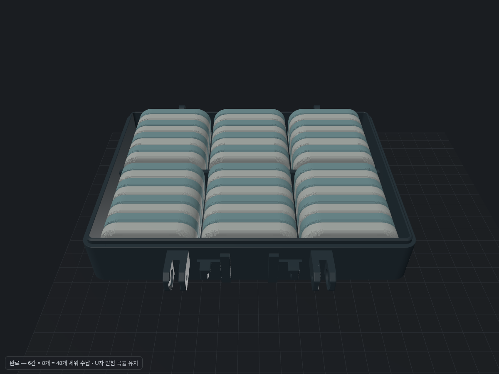

# Toolbox48 — 상판 48개를 세워 담는 케이스

기존 Toolbox42의 **U자 받침 6칸에 상판을 8개씩 세워 수납**합니다. 기준은 사용자가 올린 `sample/일괄4개_상판.3mf`의 50 × 30 × 7 mm 상판입니다. 둥근 아래쪽이 U자 받침에 들어가며, 눕히거나 위로 쌓는 구성이 아닙니다.



## 바뀐 것

| 항목 | 기존 | Toolbox48 |
|---|---|---|
| 수납 | 6칸 × 7개 = 42개 | **6칸 × 8개 = 48개** |
| 칸 깊이 | 50 mm | **57 mm**: 두께 7 mm × 8 + 여유 1 mm |
| 내부 U자 받침 | 상판 곡률에 맞춘 단면 | **동일 단면**. 곧은 구간만 칸마다 7 mm 추가 |
| 본체 앞뒤 길이 | 135.975 mm(귀 포함) | 149.975 mm(귀 포함), 총 +14 mm |
| 본체 바닥 외곽 | 첫 층부터 곡면이 급하게 넓어짐 | 외곽 밑면만 수직 받침 보강, 첫 층 EFC 0.15 선반영. 내부 U자 곡률은 그대로 |
| 뚜껑 첫 층 | v6: 일부 외곽이 첫 5층 안에서 넓어짐 | 주 외곽·탭 뿌리 모두 첫 1.2 mm 수직 받침, 첫 층 EFC 0.15 |
| 로고 | 포켓과 인레이 사이 불필요한 0.3 mm 공극 | 로고 크기는 유지, 둘레 공극을 뚜껑 색으로 채움 |
| 클립·손잡이 | 정상 작동하는 v5 | **정점·삼각형 배열 그대로** |
| 경첩·클립 결합부 | 기존 구멍·귀·탭 | 크기와 형상 유지. 뒤쪽 경첩 위치만 본체 길이 증가에 맞춰 이동 |

본체·뚜껑의 새 출력 파일은 서로 한 세트입니다. 기존 42개용 뚜껑과 새 본체를 혼용하지 않습니다. 기존 클립·손잡이는 그대로 사용할 수 있습니다.

## 출력 파일

- [플레이트 A — 본체·손잡이·클립](models/Toolbox48_A_base_handle_clip.3mf)
- [플레이트 B — 뚜껑·로고](models/Toolbox48_B_lid_logo.3mf)
- `models/Toolbox48_{base,handle,latch,lid,logo}.stl` — STL은 원래 플레이트 좌표를 유지합니다. 뚜껑·로고를 함께 가져올 때 상대 위치를 유지하세요.
- `models/Toolbox48_geometry.3mf` — 조립 검증용 입력이며 출력 플레이트가 아닙니다.
- [회전 GIF](qc/upright48/turntable.gif), [닫힘·열림·분리 GIF](qc/assembly48/turntable.gif)

일반 3MF는 `generic3mf.py`의 검증된 작성 방식을 사용합니다. A·B 모두 색 순서를 1번 `#37474f`, 2번 `#ffb300`으로 고정했습니다. Bambu Studio의 “형상만 불러오기” 알림은 이 형식의 정상 동작이며, GUI에서 직접 열어 확인한 결과는 아닙니다.

## 검증

| 검사 | 결과 |
|---|---|
| 실제 상판 배치 | **48개**, 각 부품 50 × 7 × 30 mm로 세워서 배치 |
| 상판 전체 ↔ 본체 / 닫힌 뚜껑 | 교집합 부피 **0 mm³** |
| 인접 상판 | 교집합 부피 **0 mm³**(면접촉 허용) |
| U자 단면 보존 | 앞·뒤 칸 단면 Hausdorff 거리 < **0.00002 mm** |
| 경첩 | 닫힘 포함 0~120°, 15° 간격 9개 상태: 간섭 < 0.01 mm³(부동소수점 허용오차) |
| 손잡이 | −90~90°, 15° 간격 13개 상태: 간섭 < 0.01 mm³ |
| 클립·손잡이 형상 보존 | v5 출력용 3MF와 정점·삼각형 배열 완전 일치 |
| 닫힘·삼각형 | 본체/손잡이/클립/뚜껑 각각 닫힌 메시, 조각 1. 로고는 의도된 글자 18조각 |
| 예산·베드 | A 39,508 / B 108,270 삼각형, 파트당 20만·파일당 50만 이내. 전 파트 256 × 256 × 250 안 |
| lib3mf strict | A·B **경고 0**(ASCII 경로에서 검증) |
| 뚜껑 첫 5층 | 로고 포함 외곽 단면 차이 < 0.001 mm², 첫 층 보정은 0.15 mm |
| 바닥 접지 | 본체 21,472 mm² / 뚜껑 20,973 mm², 각각 첫 층 단면과 일치 |

상판 바닥은 z=2.6, 윗부분 z=32.6 mm입니다. 각 칸 양끝 여유 0.5 mm, 가로 방향 약 0.6 mm/면입니다. 클립은 사용자가 실물 정상 작동을 확인한 기존 설계를 유지했고, 미확정 피벗으로 “결합 불가”라 단정했던 문서와 출력 메시지를 정정했습니다. 실제 클립 조립 변환은 새 수치 검사로 확정하지 않았으며, 렌더에서는 클립을 분리해서 표시합니다.

닫힌 뚜껑과 본체의 기존 끼움 공차(표면 샘플 하위 1% 약 0.10 mm, 5% 약 0.20 mm)는 유지했습니다. 손잡이 최소 샘플 거리 약 0.05 mm, 하위 1% 약 0.25 mm입니다. 표면 샘플은 전체 면의 정확한 최소 거리 보증이 아닙니다.

PLA E=3300 MPa의 단순 보 계산: 손잡이 가로대 20 N에서 처짐 0.072 mm·응력 2.22 MPa, 다리 10 N에서 0.134 mm·5.72 MPa. 길어진 뚜껑은 140 mm 단순지지·중앙 20 N 가정에서 1.38 mm·3.63 MPa입니다. 이 값은 대략적인 보 모델이며 실제 적층·조인트 강도나 클립 힘을 측정한 결과가 아닙니다.

## 남아 있는 QC 경고와 출력 설정

[플레이트 A QC](qc/plate_A/report.md), [플레이트 B QC](qc/plate_B/report.md)는 경고를 숨기지 않은 원본 검사 결과입니다.

- 본체 앞쪽 손잡이 귀 아래(z≈13.5)와 뚜껑 경첩·걸쇠 탭 아래는 **설계상 돌출부**입니다. “빌드 플레이트에만” 서포트를 켜고, 슬라이스 미리보기에서 이 부위와 5 mm를 넘는 브리지가 받쳐지는지 확인하세요. 본체 최대 측정 브리지 약 9.4 mm, 뚜껑 약 10.1 mm입니다. 무서포트 출력용으로 주장하지 않습니다.
- 본체의 U자 받침 일부와 뚜껑 경첩 귀의 국부 얇은 영역은 기존 맞춤 곡률·결합 형상을 보존해 남겼습니다. QC의 1.2 mm 미만 영역 경고는 각각 약 115.6 / 33.1 mm²입니다. 이를 모든 벽의 최소 두께가 보장됐다는 뜻으로 해석하지 않습니다.
- 클립은 정상 작동하는 형상을 유지했으므로 기존 국부 얇은 영역 경고(11.6 mm²)도 남아 있습니다. 이 검사 경고만으로 클립 고장을 주장하지 않습니다.
- 로고는 0.6 mm 인레이·여러 글자 조각이라는 의도된 장식 예외입니다. 파트를 따로 검사하면 서로 다른 색이 받치는 면도 브리지로 집계됩니다. 로고와 뚜껑을 한 오브젝트로 출력하고 전체 슬라이스를 보세요.
- **코끼리발 보정 0.15 mm**, 층 높이 0.2 mm, P1S 0.4 노즐, PLA. 긴 외곽과 멀티컬러 뚜껑은 outer brim 약 5 mm를 권장합니다. 기존 조립용 M3×14 볼트를 유지합니다.

실제 출력·Bambu Studio GUI·실물 조립 검증은 아직 하지 않았습니다. 출력 확인 전까지 `작업중/`에 둡니다.

## 재현

```bash
cd /workspace/3mf-maker
source /workspace/3mf-maker-venv/bin/activate
export MPLCONFIGDIR=/workspace/3mf-maker-setup/matplotlib
python 작업중/toolbox48/scripts/build_toolbox48.py
python 작업중/toolbox48/scripts/validate_toolbox48.py
python tools/qc_model.py 작업중/toolbox48/models/Toolbox48_A_base_handle_clip.3mf --out 작업중/toolbox48/qc/plate_A --no-render
python tools/qc_model.py 작업중/toolbox48/models/Toolbox48_B_lid_logo.3mf --out 작업중/toolbox48/qc/plate_B --max-bridge 5 --no-render
python 작업중/toolbox48/scripts/preview_toolbox48.py
```

`validate_toolbox48.py`는 검증 데이터, 48개 배치와 조립 시각화 입력을 생성합니다. 이 파일들과 브라우저용 중간 데이터는 재생성되며, 렌더된 PNG·GIF와 검증 JSON은 기록으로 남깁니다.
